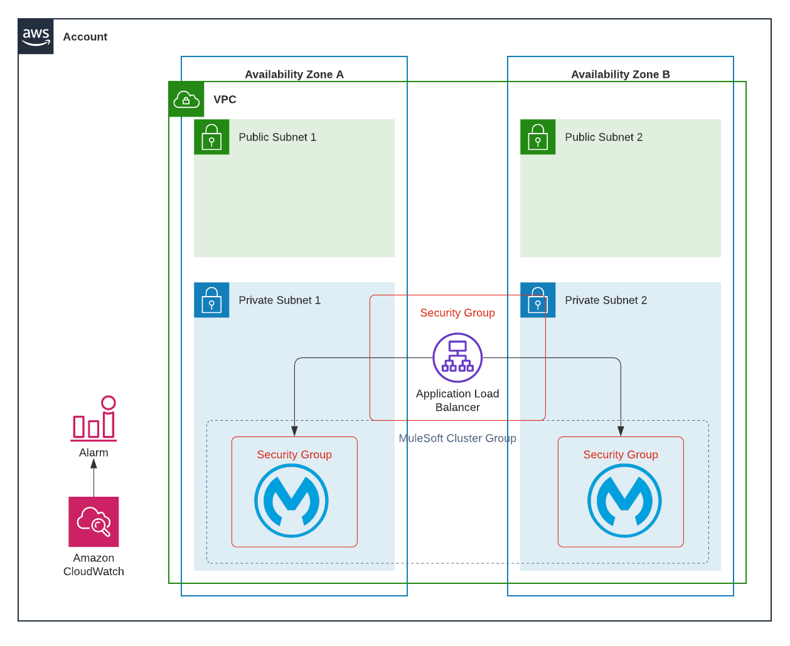

# AWS Terraform & Ansible Mule Runtime Deployment

This repository contains the terraform and ansible-playbook to deploy several runtimes fronted with an application load balancer to an AWS account. Several prerequisites are required before deployment can begin:

1. VPC with one or more subnets across availability zones
2. S3 Bucket configured for managing terraform state files
3. A deployment role for deploying terraform configurations
4. SSH Key Pairs
5. You want to deploy Mule v 4.2.2 (Health check functionality was introduced in 4.2.2)

## The Objective

The objective of the repo is to create a terraform configuration, which can build immutable infrastructure that is consistent across multiple environments while being customisable and extendable, a full end to end solution for deploying a Mule runtime environment ready application deployment. Assuming you wish to only load balance across experience APIs, with process and system APIs being accessed on localhost.

Simplifying the process by only needing to update variables in a couple of places, even those variables that are used by Ansible such as memory configuration of JVM.

# What Terraform deploys?



## EC2 Instance(s)

Terraform will deploy the desired number of runtimes, across the VPC and subnets that you specify in the variable files, creating a security group that allows traffic from the load balancer on the Mule experience port, SSH access for a management subnets.

For development and test, additional rules are configurable, which would enable access to mule developers to ports you desire. For example, to enable access to experience, process and system APIs to developers to test from 10.0.0.0/24 CIDR, you specify in the environment-specific variables:
```
    sg_ec2_ports = [8081,8082,8083]
    developer_ingress_src = ["10.0.0.0/24"]
 ```
By default, egress traffic has been enabled for 0.0.0.0/0 on ports 80 & 443 (this is to update software and download the likes of Mule and CloudWatch agent). To amend this level of access update the variables in the root variables.tf configuration:
```
    variable "default_sg_egress_dst" {
	    type 		= list(string)
	    description = "List of allowed egress CIDR blocks"
	    default 	= ["0.0.0.0/0"]
    }
    variable "sg_ec2_egress_ports" {
	    type        = list(number)
	    description = "The ports to allow egress traffic from the security group"
	    default     = [80,443]
    }
```
To extend access, create additional rules in the EC2-mule-runtime module security-group.tf.

The EC2 instances have CloudWatch alarms configured for:

1. CPU Usage
2. Instance state and automatic reboot if hung
3. Memory & Disk Usage (Ansible configures the CloudWatch Agent)

Instance Protection, to prevent accidental deletion instance protection has been enabled when the environment variable is 'prod'.

By default, EBS volumes are encrypted using a customer-managed KMS key specified in the EC2 instance module.

## IAM Instance role

IAM instance role is created and assigned to each of the instances that allow access to the CloudWatch log group, to create log streams and to put events. While also allowing access to the CloudWatch agent to push metric data.

# Application Load Balancer

Terraform deploys an application load balancer, which enables access on port 443, by default dropping TLS and passing on traffic to the Mule experience API port. A security group is configured to allow traffic from your chosen CIDRs and tightly controlling egress traffic to the EC2 instances. A CloudWatch alarm reports on host health, but this does need additional work (see the to-do section).

# Terraform Outputs

As mentioned earlier, the goal was to allow the end to end deployment to be controlled from as fewer variable files as possible. I don't want to have to several configurations across terraform and Ansible, removing the need to manage Ansible inventory files. The local file terraform resource outputs Ansible variables and inventory files, CloudWatch agent configuration, as well as the Mule service that configures the MULE_ENV environment variable. Templates are stored in the EC2 instance module, that work with the local file resource specified in outputs.tf, for example:
```
    resource "local_file" "hosts" {
	    content = templatefile("${path.module}/templates/hosts.tmpl",
	    {
		    host = aws_instance._.*.tags.Name,
		    private-ip = aws_instance._.*.private_ip,
		    private-id = aws_instance._.*.id,
		    sshkey = var.ssh_keypair
	    })
	    filename = "ansible/hosts.ini"
    }
```
# Ansible

Ansible updates the OS and ensures all packages are up to date, before installing additional dependencies:

1. Unzip
2. AdoptOpenJDK-8-Hotspot

The playbook downloads the AWS CloudWatch agent for Ubuntu and verifies the signature before configuring using the agent config output from Terraform. Ansible then proceeds to create a mule user and group, downloading and configuring Mule to run under the mule user as a service. Mule is registered within the Mulesoft AnyPoint platform using the AMC command, the license installed, then the service enabled and started.

# To-do

1. EC2 Instance Cluster Traffic Security Group Rules
2. S3 Bucket for load balancer access logs
3. ~~CloudWatch Log Collection for Mule Applications~~ & Alarms
4. Hardening of the OS
5. ~~Load balancer health check configuration~~
6. SNS Topic for CloudWatch Alarms
7. Tidy up the code & make more variables configurable
8. Mule Custer configuration
9. ~~Cloudwatch log stream to use Instance Name instead of Instance ID (if possible) to make it easier to identify servers in CloudWatch logs.~~
10. Additional volume added to EC2 instance for the Mule runtime installation
11. Amend the EC2 ALB security group source to be a string list, to support for example a private and public load balancer.
12. Implement filters to select VPC ID and Subnets (you will need consistent VPC and Subnet naming conventions!)
13. Add NTP settings for the host and allow egress traffic
14. Integrate with Systems Manager to control updates
15. Improve Ansible playbook so we can upgrade, amend components currently only for first time deployments

Any other suggestions, please shout out.

# How to use

## Mulesoft License

Your enterprise license must replace a license file place holder:
```
    ansible/files/license.lic
```
## state.tf

The state configuration must be updated to match your environment:
```
    terraform {
      backend "s3" {
        bucket    = "<CHANGE TO YOUR S3 BUCKET>"
        key       = "<CHANGE TO YOUR S3 BUCKET KEY>"
        region    = "<CHANGE TO YOUR REGION>"
        role_arn  = "<CHANGE TO YOUR ROLE ARN>"
      }
    }
```
## local.tf
The local.tf_deploy_arn must be updated with the ARN of your IAM terraform deployment role.
```
    locals {
      tf_deploy_arn = "<CHANGE TO YOUR TERRAFORM DEPLOYMENT ROLE ARN>"
```
## variables.tf
The following variables need to be set/updated to match your environment:

A namespace is a prefix applied to all names, update this variable to match your chosen naming convention:
```
    variable "namespace" {
      type              = string
      description       = "The namespace to be applied typically a prefix for naming convention"
      default           = ""
    }
```
The app variable is used throughout the Terraform configuration to set the likes of EC2 instance names and labels. If you wish to amend the naming convention update this variable:
```
    variable "app" {
      type                  = string
      description           = "The name of the app or service"
      default               = "mule-runtime"
    }
```
By default the Mule Experience port has been set to 8083, update this variable to match your environment:
```
    variable "mule_exp_port" {
      type                  = number
      description           = "The port number of the experience api"
      default               = 8083
    }
```
By default the CloudWatch agent will aggregate logs for all mule apps based on the suffix '-api', update this variable to match your naming conventions
```
variable "mule_app_suffix" {
  type                  = string
  description           = "The suffix applied to all mule app names deployed to a runtime, this is used to ingest the log files into CloudWatch"
  default               = "-api"
}
```
Application load balancing health checks is implemented using the status service introduced in Mule 4.2.2, ensure you update this variable with the API you wish to use for monitoring host health:
```
variable "mule_health_check_application_name" {
  type                  = string
  description           = "The application name which the load balancer will perform application health checks against"
  default               = ""
}
```
By default the Ubuntu image in eu-west-2 has been used, update this variable to use your own AMI:
```
    variable "ami" {
      type                  = string
      description           = "The AMI ID of the image to deploy."
      default               = "ami-0b79808e499cf3385"
    }
```
To tightly control access to port 22 of the EC2 instances, update the variable 'mgmt_ingress_src' with the required CIDR ranges.
```
    variable "mgmt_ingress_src" {
      type        = list(string)
      description = "List of allowed ingress CIDR blocks to be able to access the instances on port 22"
      default     = [""]
    }
```
By default CloudWatch log retention has been set to 90 days, to amend update the variable:
```
    variable "log_retention_in_days" {
      type                  = number
      description           = "The number of days to retain cloudwatch logs for"
      default               = 90
    }
```
## tfvars

Environment tfvars allow customisation of each environment to meet the desired state, and this is anything from the EC2 instances to the number of instances to deploy. JVM memory and metaspace allocations can also be updated per environment to fit in with the EC2 instance size. Example:

```
    environment             = "dev"
    vpc_id                  = "vpc-1234567890"
    private_subnet_ids      = ["subnet-1234567890","subnet-0987654321"]

    instance_count          = 2
    sg_ec2_ports            = [8081,8082,8083]
    instance_type           = "t2.micro"
    ssh_keypair             = "my-ssh-key-pair"
    developer_ingress_src   = ["192.168.1.0/24"]
    root_volume_type        = "gp2"
    root_volume_size        = "50"

    certificate_arn         = "arn:aws:acm:eu-west-2:<account-id>:certificate:<cert-guid>"
    alb_sg_ingress_src      = ["192.168.1.1/24","172.1.1.0/24"]

    custom_metric_namespace = "DevMuleRuntimes"

    mule_version              = "4.3.0"
    mule_region               = "eu1"
    mule_amc                  = "./amc_setup -H 12303302323023-2323-2-32-323---357769"

    java_metaspace_initial    = "128m"
    java_metaspace_max        = "256m"

    java_memory_initial       = "128"
    java_memory_max           = "256"
```

P.S I know these JVM sizes aren't big enough to run anything meaningful, its just an example ;)

# Commands

To review and deploy the infrastructure to the development environment and configure the EC2 instances run the following commands:
```
terraform plan -var-file="_dev.tfvars"  
```
Review the output and once happy:
```
terraform apply -var-file="_dev.tfvars"  
```
```
ansible-playbook ansible/playbook.yml  
```  

# Variable Descriptions

Coming soon!
